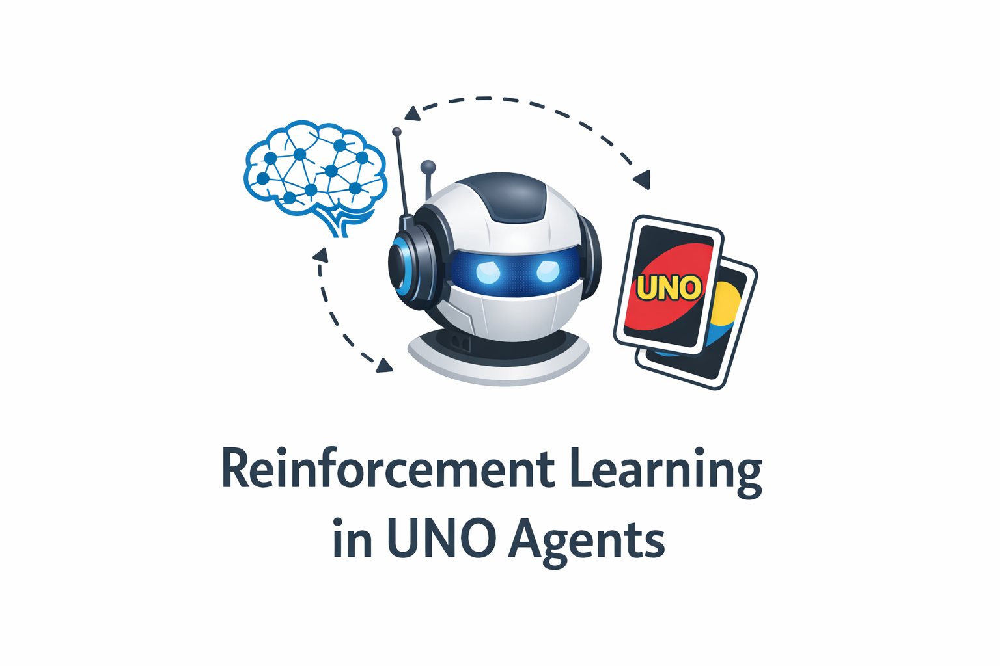

<p align="center">
  
</p>

# Uno CoreML TUI

Train Uno RL agents (DQN + DeepSARSA), export to Core ML, and play via a polished terminal UI.

## Key Findings

**From 100,000 Simulated Games:**
- Average game length: **46.5 turns** (mode: 13, right-skewed distribution)
- First player advantage: **51.07%** win rate (~2% edge)
- Games range from 7 to 418 turns

**RL Agent vs LLMs (Tournament Results):**

| Opponent | RL Win Rate |
|----------|-------------|
| Gemini 3 Flash | **80%** |
| GPT 5.2 | **80%** |
| Opus 4.5 | **20%** |

> The stark reversal against Opus 4.5 suggests superior *agentic reasoning* capabilities in strategic tasks.

See [docs/BLOG.md](docs/BLOG.md) for the full academic writeup with charts and analysis.

## Features

- **RL Training**: DQN and DeepSARSA agents with tournament-based training
- **Core ML Export**: Export trained models for efficient inference on Apple devices
- **Terminal UI**: Beautiful TUI built with Textual for playing Uno
- **Multiple Opponents**: Play vs RL agent, LLM opponent (via OpenRouter), or another human

## Installation

```bash
# Clone and install
cd uno-coreml-tui
pip install -e .

# For development
pip install -e ".[dev]"
```

## Quick Start

### 1. Train Agents

```bash
# Train DQN agent (default: 1000 iterations, 100 games per iteration)
python -m rl.dqn_train --iters 1000 --games_per_iter 100

# Train DeepSARSA agent
python -m rl.sarsa_train --iters 1000 --games_per_iter 100

# Quick test run
python -m rl.dqn_train --iters 10 --games_per_iter 10
```

**CLI Arguments:**
- `--iters`: Number of training iterations (default: 1000)
- `--games_per_iter`: Games per tournament iteration (default: 100)
- `--alpha`: Learning rate (default: 1e-4)
- `--gamma`: Discount factor (default: 0.95)
- `--epsilon_start`: Initial epsilon for e-greedy (default: 0.95)
- `--kappa`: Epsilon decay factor (default: 0.995)
- `--seed`: Random seed (default: 42)
- `--device`: Device to use (default: cuda if available, else cpu)

### 2. Evaluate Agents

```bash
# Run evaluation tournament
python -m rl.eval --run_id <run_id> --games 1000
```

### 3. Generate Plots

```bash
# Generate all plots from training logs
python -m rl.plots --run_id <run_id>
```

### 4. Export to Core ML

```bash
python -m rl.export_coreml --in models/best_qnet.pt --out models/best_qnet.mlpackage
```

### 5. Play in Terminal

```bash
# Start the TUI
python -m tui.app

# Or use the installed command
uno-tui
```

## Game Modes

1. **Play vs RL Agent (Core ML)**: Play against the trained RL model
2. **Play vs LLM Opponent (OpenRouter)**: Play against an LLM (requires API key)
3. **Human vs Human**: Local multiplayer

For LLM opponent, set your API key:
```bash
export OPENROUTER_API_KEY=your_key_here
```

## TUI Controls

- **Number keys (0-9)**: Select card by index
- **D**: Draw a card
- **Q**: Quit game
- **R/G/B/Y**: Choose color when playing Wild

## Artifacts

Training runs are saved to `runs/<run_id>/` with:

```
runs/<run_id>/
├── config.json              # Training configuration
├── metrics_train.csv        # Training metrics (iteration, epsilon, avg_reward, etc.)
├── metrics_eval.csv         # Evaluation metrics
├── tournaments/
│   ├── dqn_iter_<i>.jsonl   # Per-iteration game logs
│   └── sarsa_iter_<i>.jsonl
└── plots/
    ├── fig1_network_arch.png/svg
    ├── fig2_dqn_avg_reward_over_iters.png/svg
    ├── fig3_sarsa_avg_reward_over_iters.png/svg
    ├── fig_training_comparison_winrate.png/svg
    └── fig_training_comparison_reward.png/svg
```

## Model Architecture

```
Input (420) -> Dense (512, ReLU) -> Dense (512, ReLU) -> Output (61)
```

**State Encoding (420 = 7 x 4 x 15):**
- Planes 0-2: Own hand count buckets (0, 1, 2+) per card type
- Planes 3-5: Opponents' card counts (0, 1, 2+)
- Plane 6: Top discard card (one-hot)
- 4 colors x 15 card types per plane

**Action Space (61):**
- Actions 0-59: Play specific card (color x type)
- Action 60: Draw a card

## RL Algorithm

We use **Deep Q-Network (DQN)** with the following core equations:

**Bellman Optimality Equation:**
```
Q*(s, a) = E[r + gamma * max_a' Q*(s', a') | s, a]
```

**TD Learning Update:**
```
Q(s,a) <- Q(s,a) + alpha * [r + gamma * max_a' Q(s',a') - Q(s,a)]
```

**Loss Function (MSE):**
```
L(theta) = E[(r + gamma * max_a' Q(s',a'; theta-) - Q(s,a; theta))^2]
```

**Epsilon-Greedy Exploration:**
```
pi(a|s) = argmax_a Q(s,a)  with probability (1-epsilon)
        = random action    with probability epsilon

epsilon <- kappa * epsilon  (decay after each iteration, kappa = 0.995)
```

**Hyperparameters:**

| Parameter | Value | Description |
|-----------|-------|-------------|
| alpha | 1e-4 | Learning rate |
| gamma | 0.95 | Discount factor |
| epsilon_0 | 0.95 | Initial exploration |
| kappa | 0.995 | Epsilon decay |
| Batch | 256 | Replay batch size |

## Project Structure

```
uno-coreml-tui/
├── uno/                 # Game engine
│   ├── cards.py        # Card definitions
│   ├── encoding.py     # State/action encoding
│   ├── rlcard_env.py   # RLCard wrapper
│   └── ruleset.py      # Game rules
├── rl/                  # RL training
│   ├── dqn_train.py    # DQN training
│   ├── sarsa_train.py  # DeepSARSA training
│   ├── eval.py         # Evaluation
│   ├── plots.py        # Plot generation
│   ├── qnet_torch.py   # Q-Network
│   ├── random_agent.py # Random baseline
│   └── export_coreml.py
├── opponents/           # Opponent adapters
│   ├── base.py
│   ├── rl_coreml.py
│   ├── rl_torch.py
│   ├── llm_openrouter.py
│   └── random_bot.py
├── tui/                 # Terminal UI
│   ├── app.py
│   ├── screens.py
│   └── widgets.py
├── docs/
├── models/
├── runs/
└── replays/
```

## License

MIT
