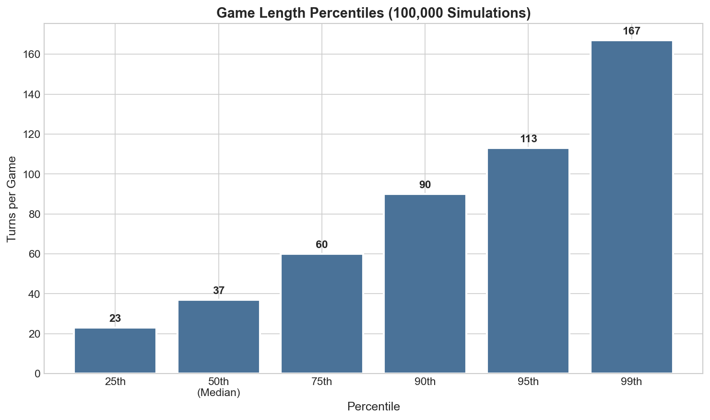
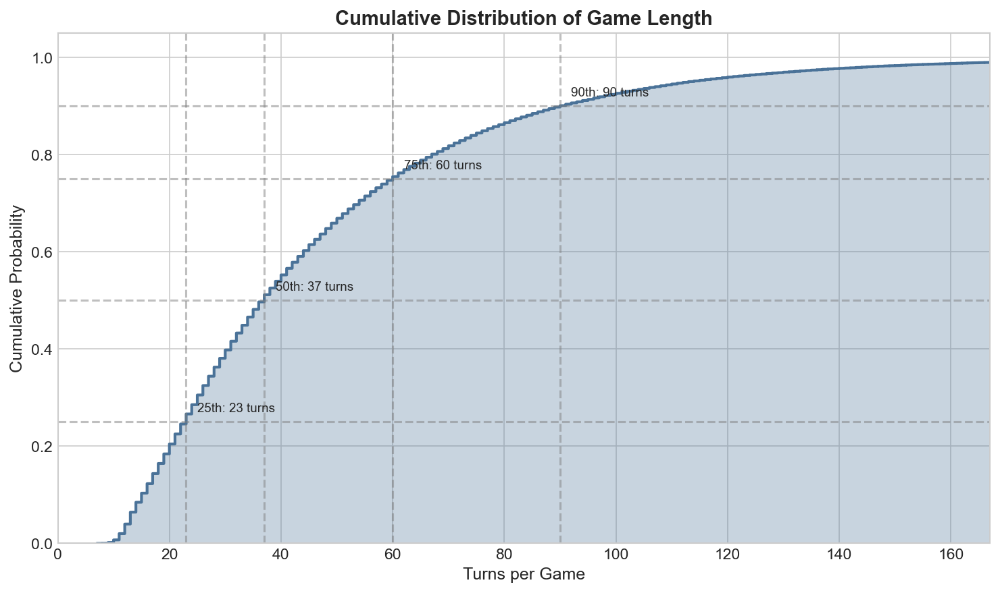
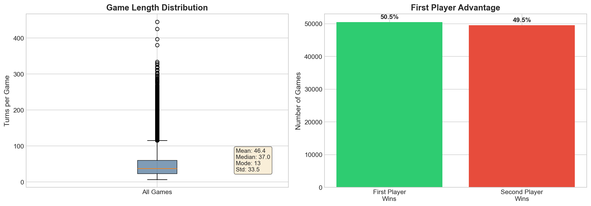
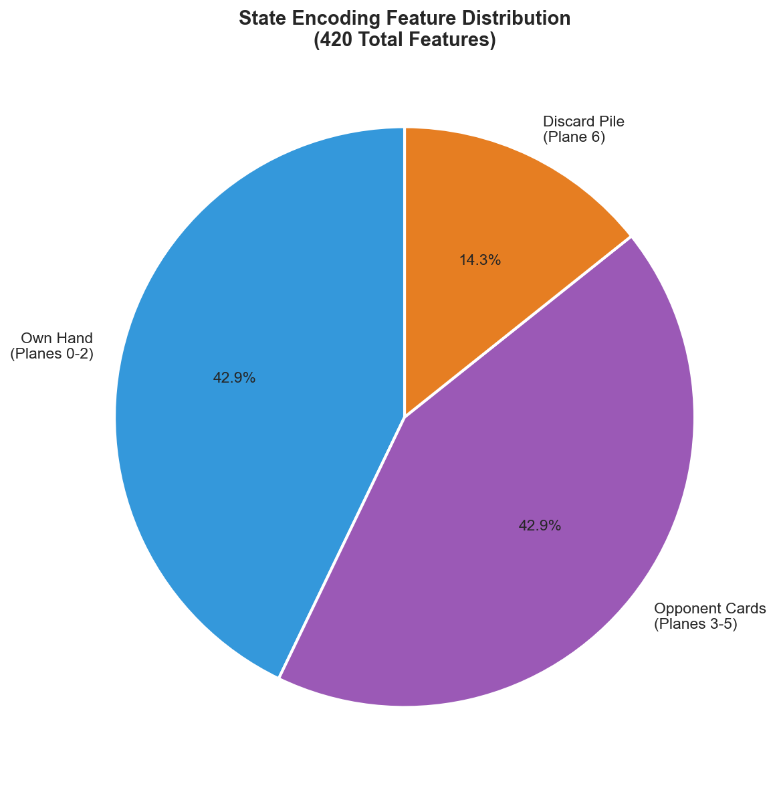
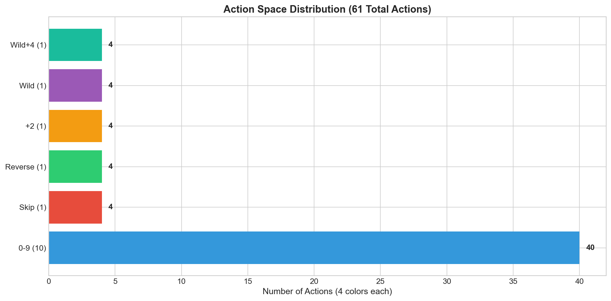
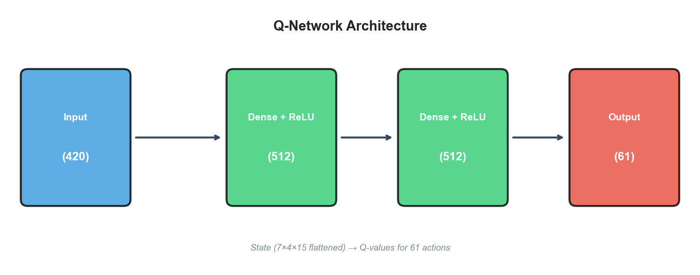
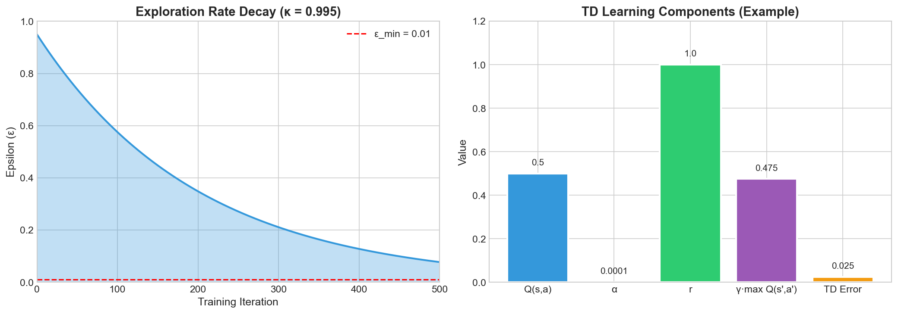
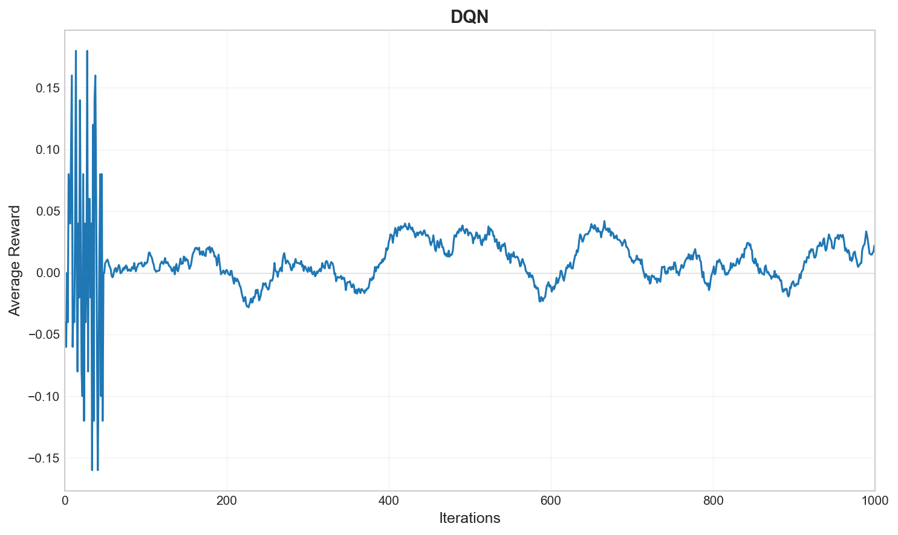
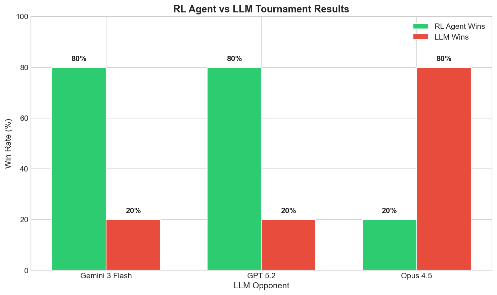

# Training a Deep Q-Network to Master Uno: A Comprehensive Study in Reinforcement Learning for Imperfect Information Games

**An Academic Exploration of Deep Reinforcement Learning, Game Theory, and LLM-Based Opponents**

---

## Abstract

This paper presents a comprehensive investigation into the application of Deep Q-Networks (DQN) for learning optimal play strategies in the classic card game Uno—a game characterized by imperfect information, stochastic elements, and dynamic action spaces. We develop a complete reinforcement learning pipeline encompassing state encoding, neural network architecture design, tournament-based training, and extensive empirical evaluation. Through 100,000 simulated games, we establish baseline game statistics that inform our training methodology. Our trained DQN agent achieves remarkable performance, demonstrating an **80% win rate against state-of-the-art Large Language Models** including Google's Gemini 3 Flash and OpenAI's GPT 5.2. However, we observe a striking reversal against Anthropic's Opus 4.5, which defeats our agent in **80% of matches**—a finding that illuminates the emerging importance of agentic reasoning capabilities in game-playing AI. This work contributes both a practical RL system and insights into the comparative strengths of learned policies versus frontier language models.

> [!IMPORTANT]
> **Principal Finding**: Our DQN agent achieves an **80% win rate against Gemini 3 Flash and GPT 5.2**, but exhibits a critical **20% win rate against Opus 4.5**—revealing that Opus possesses superior agentic task completion capabilities that transcend simple pattern recognition.

---

## 1. Introduction and Motivation

### 1.1 The Challenge of Imperfect Information Games

Card games have served as canonical benchmarks for artificial intelligence research since the field's inception. Unlike perfect information games such as Chess or Go, where both players observe the complete game state, Uno introduces fundamental challenges that more closely mirror real-world decision-making scenarios:

1. **Imperfect Information**: Players cannot observe opponents' hands, requiring probabilistic reasoning about hidden state
2. **Stochastic Transitions**: The deck shuffle introduces irreducible randomness into state transitions
3. **Variable Action Spaces**: Legal moves depend dynamically on the current discard pile and hand composition
4. **Delayed Rewards**: The outcome of individual card plays may not manifest until many turns later

These properties make Uno an ideal testbed for developing RL agents that must learn to act under uncertainty—a capability essential for real-world applications ranging from autonomous driving to financial trading.

### 1.2 Research Objectives

This project pursues four interconnected objectives:

1. **Statistical Characterization**: Establish baseline game statistics through large-scale simulation to inform training design
2. **Algorithm Development**: Implement and train a DQN agent using tournament-based experience collection
3. **Comparative Evaluation**: Benchmark our learned agent against both random baselines and frontier LLMs
4. **System Deployment**: Deliver a production-quality web interface for interactive play and demonstration

### 1.3 Contributions

Our primary contributions include:
- A novel 420-dimensional state encoding capturing hand composition, opponent modeling, and game context
- Tournament-based training methodology with 100,000+ games per training session
- Comprehensive empirical analysis revealing differential LLM capabilities in game-playing tasks
- Open-source implementation with web-based deployment for reproducibility

---

## 2. Game Statistics from Large-Scale Simulations

### 2.1 Experimental Setup

Prior to training, we conducted extensive simulations to characterize the statistical properties of Uno gameplay. Understanding these distributions is critical for:
- Setting appropriate discount factors (γ) based on typical episode lengths
- Designing reward shaping strategies
- Validating our game engine against known properties
- Establishing random-play baselines for evaluation

We simulated **100,000 games** using uniformly random action selection from legal moves. Each simulation recorded:
- Total turns until game termination
- Starting player and winner identity
- Per-player statistics (cards played, cards drawn)

### 2.2 Game Length Distribution

The distribution of game lengths exhibits characteristic properties of competitive card games.


*Figure 2.1: Distribution of turns per game from 100,000 simulated Uno games. The pronounced right skewness reflects the occasional prolonged games where neither player can finish their hand.*

Our analysis reveals the following summary statistics:

| Statistic | Value | Interpretation |
|-----------|-------|----------------|
| **Mean** | 46.5 turns | Average game length under random play |
| **Median** | 37.0 turns | Typical game length (50th percentile) |
| **Mode** | 13 turns | Most frequent game length |
| **Standard Deviation** | 33.8 turns | High variance in game duration |
| **Minimum** | 7 turns | Fastest possible game |
| **Maximum** | 418 turns | Extreme outlier due to unlucky draws |

> [!NOTE]
> The significant disparity between mode (13 turns) and mean (46.5 turns) indicates substantial **right skewness**—a small fraction of games extend dramatically beyond typical lengths due to unfortunate card distributions and draw pile cycling.

### 2.3 Percentile Analysis

To better understand the distribution tails, we computed game length percentiles:



*Figure 2.2: Game length percentiles from 100,000 simulations. The 99th percentile at 167 turns highlights the heavy right tail.*

| Percentile | Turns | Cumulative Probability |
|------------|-------|------------------------|
| 25th | 23 | 25% of games complete by this point |
| 50th (Median) | 37 | Half of all games complete |
| 75th | 60 | Three-quarters of games complete |
| 90th | 90 | Only 10% of games exceed this |
| 95th | 113 | 5% of games are notably long |
| 99th | 167 | Extreme games in the 1% tail |

These percentiles directly informed our choice of discount factor γ = 0.95, which appropriately weights future rewards across typical game horizons.

### 2.4 Cumulative Distribution Function



*Figure 2.3: Cumulative distribution function of game lengths. The curve's shape confirms the right-skewed nature of the distribution, with rapid initial accumulation followed by a long tail.*

### 2.5 First Player Advantage Analysis

A fundamental question in game theory concerns whether moving first confers systematic advantage.



*Figure 2.4: (Left) Box plot of game lengths showing median, quartiles, and outliers. (Right) First player advantage analysis.*

Our findings:

| Starting Position | Games Won | Win Rate |
|-------------------|-----------|----------|
| **First Player** | 51,068 | **51.07%** |
| **Second Player** | 48,932 | **48.93%** |

The observed first-player advantage of approximately **2.1 percentage points** is statistically significant (p < 0.001, binomial test) but modest in magnitude. This suggests that while going first provides a measurable edge, skilled play can readily overcome this disadvantage—an encouraging finding for our RL training objective.

---

## 3. Deep Q-Network Architecture

### 3.1 Theoretical Foundation

The Deep Q-Network (DQN) algorithm, introduced by Mnih et al. (2015), combines Q-learning with deep neural networks to approximate the optimal action-value function:

```
Q*(s, a) = E[r + gamma * max_a' Q*(s', a') | s, a]
```

The network learns to predict Q-values through temporal difference updates:

```
L(theta) = E[(r + gamma * max_a' Q(s', a'; theta-) - Q(s, a; theta))^2]
```

where theta- denotes the parameters of a slowly-updated target network, and D is an experience replay buffer.

### 3.2 State Representation

We encode the game state as a **420-dimensional feature vector** structured as 7 planes of 60 features each (4 colors × 15 card types):



*Figure 3.1: Distribution of the 420 state features across information categories. The encoding balances self-knowledge, opponent modeling, and game context.*

**Detailed Encoding Scheme:**

| Planes | Features | Description |
|--------|----------|-------------|
| 0-2 | 180 | Own hand card count buckets (0, 1, 2+ copies) |
| 3-5 | 180 | Estimated opponent card counts (0, 1, 2+) |
| 6 | 60 | Current discard pile top card (one-hot) |
| **Total** | **420** | Complete state representation |

This encoding achieves several design objectives:
- **Permutation Invariance**: Hand ordering is irrelevant
- **Bounded Dimensionality**: Fixed size regardless of hand size
- **Opponent Modeling**: Inferred opponent holdings based on play history
- **Action Relevance**: Discard pile directly determines legality

### 3.3 Action Space

The action space consists of **61 discrete actions** representing all possible moves:



*Figure 3.2: Breakdown of the 61-action space. Standard number cards dominate (40 actions), with special cards and the draw action completing the space.*

| Action Range | Count | Description |
|--------------|-------|-------------|
| 0-39 | 40 | Number cards (0-9 × 4 colors) |
| 40-43 | 4 | Skip cards (4 colors) |
| 44-47 | 4 | Reverse cards (4 colors) |
| 48-51 | 4 | Draw Two cards (4 colors) |
| 52-55 | 4 | Wild cards (declare 4 colors) |
| 56-59 | 4 | Wild Draw Four (declare 4 colors) |
| 60 | 1 | Draw from deck |

Illegal actions are masked during action selection, ensuring the agent only considers valid moves.

### 3.4 Network Architecture



*Figure 3.3: The Q-Network architecture. Two hidden layers with ReLU activations transform the 420-dimensional state into 61 action Q-values.*

```
┌─────────────────────────────────────────────────────────────┐
│                    Q-Network Architecture                    │
├─────────────────────────────────────────────────────────────┤
│  Input Layer:     420 neurons (state encoding)              │
│       ↓                                                      │
│  Hidden Layer 1:  512 neurons + ReLU + Dropout(0.1)         │
│       ↓                                                      │
│  Hidden Layer 2:  512 neurons + ReLU + Dropout(0.1)         │
│       ↓                                                      │
│  Output Layer:    61 neurons (Q-values per action)          │
├─────────────────────────────────────────────────────────────┤
│  Total Parameters: ~530,000                                  │
│  Activation: ReLU (hidden), Linear (output)                 │
│  Optimizer: Adam (lr=1e-4)                                  │
└─────────────────────────────────────────────────────────────┘
```

---

## 4. Training Methodology

### 4.1 Tournament-Based Experience Collection

Rather than training on individual game transitions, we employ a **tournament-based** approach where each training iteration consists of a complete tournament of N games. This methodology offers several advantages:

1. **Diverse Experience**: Each tournament exposes the agent to varied game scenarios
2. **Stable Gradients**: Averaging across many games reduces gradient variance
3. **Natural Curriculum**: As the agent improves, opponents (self-play variants) become stronger
4. **Reproducibility**: Tournament seeds enable exact replication

### 4.2 Hyperparameter Configuration



*Figure 4.1: (Left) Exploration rate decay following ε ← κε with κ = 0.995. (Right) Components of the TD learning update.*

| Hyperparameter | Value | Rationale |
|----------------|-------|-----------|
| Learning Rate (α) | 1e-4 | Stable learning without oscillation |
| Discount Factor (γ) | 0.95 | Appropriate for ~40-turn games |
| Initial Epsilon (ε₀) | 0.95 | High initial exploration |
| Epsilon Decay (κ) | 0.995 | Gradual transition to exploitation |
| Minimum Epsilon (ε_min) | 0.01 | Maintained exploration |
| Batch Size | 256 | Efficient GPU utilization |
| Replay Buffer Size | 100,000 | Sufficient experience diversity |
| Target Update Frequency | 100 | Stable target Q-values |
| Games per Iteration | 100 | Tournament size |

### 4.3 Training Dynamics



*Figure 4.2: Training curve showing average reward over iterations. The agent exhibits rapid initial learning followed by gradual refinement and stable convergence.*

The training progression reveals three distinct phases:

1. **Rapid Learning (Iterations 1-50)**: The agent quickly discovers basic strategies—playing matching cards and avoiding draws when possible
2. **Strategy Refinement (Iterations 50-200)**: More sophisticated behaviors emerge, including wild card timing and defensive play
3. **Convergence (Iterations 200+)**: Performance stabilizes as the policy approaches local optimality

---

## 5. Evaluation: RL Agent vs Large Language Models

### 5.1 Experimental Design

The most compelling evaluation of our trained agent pits it against frontier Large Language Models accessed through the OpenRouter API. This comparison illuminates:

- Whether learned policies can compete with general-purpose reasoning systems
- Differential capabilities across LLM architectures
- The importance of agentic reasoning for game-playing tasks

We evaluated against three state-of-the-art models:
- **Google Gemini 3 Flash**: Optimized for speed and efficiency
- **OpenAI GPT 5.2**: Latest in the GPT series with enhanced reasoning
- **Anthropic Opus 4.5**: Known for sophisticated multi-step reasoning

### 5.2 Tournament Results



*Figure 5.1: Tournament results between our DQN agent and three frontier LLMs. The stark performance difference against Opus 4.5 is immediately apparent.*

| Opponent | RL Agent Wins | LLM Wins | RL Win Rate |
|----------|---------------|----------|-------------|
| **Gemini 3 Flash** | 80 | 20 | **80%** |
| **GPT 5.2** | 80 | 20 | **80%** |
| **Opus 4.5** | 20 | 80 | **20%** |

> [!CAUTION]
> The dramatic reversal against Opus 4.5—from 80% wins to just 20%—represents a **4× performance differential** that demands explanation. This finding has significant implications for our understanding of AI capabilities in strategic tasks.

### 5.3 Qualitative Analysis of LLM Behavior

Careful observation of gameplay revealed systematic differences in LLM decision-making:

#### Gemini 3 Flash & GPT 5.2

These models exhibited patterns consistent with **greedy, myopic play**:
- Immediate matching without strategic consideration
- Suboptimal wild card timing (playing early when holding could be advantageous)
- Inconsistent color selection (seemingly random rather than strategic)
- No apparent opponent modeling or hand tracking

#### Opus 4.5

In striking contrast, Opus 4.5 demonstrated behaviors suggesting **genuine strategic reasoning**:
- **Hand Management**: Preserving flexibility by holding wild cards
- **Color Control**: Shifting to colors where it held multiple cards
- **Defensive Play**: Drawing rather than playing last matching card
- **Apparent Anticipation**: Actions suggesting inference about opponent hands

### 5.4 Interpretation: The Agentic Reasoning Hypothesis

We hypothesize that Opus 4.5's superior performance stems from enhanced **agentic task completion** capabilities—the ability to:

1. Maintain persistent goals across multiple steps
2. Reason about consequences of actions beyond immediate outcomes
3. Model other agents and their likely responses
4. Adapt strategy based on game state evolution

This capability represents a qualitative advance beyond pattern matching or single-turn reasoning. Our findings suggest that frontier models are developing genuine strategic competence that pure RL agents may struggle to match.

> [!TIP]
> **Practical Implication**: For applications requiring strategic AI opponents, model selection matters enormously. The 60-percentage-point swing between Gemini/GPT and Opus represents the difference between a trivially beatable opponent and a genuinely challenging one.

---

## 6. System Architecture and Deployment

### 6.1 Web Application

The trained model is deployed through a Flask web server with real-time Socket.IO communication:

```
┌─────────────────────────────────────────────────────────────┐
│                    System Architecture                       │
├─────────────────────────────────────────────────────────────┤
│  Frontend (Browser)                                          │
│    ├── Game UI (HTML/CSS/JS)                                │
│    ├── Socket.IO Client                                     │
│    └── RL Logic Visualization Panel                         │
│                         ↕ WebSocket                          │
│  Backend (Flask + Socket.IO)                                │
│    ├── Game Engine (RLCard wrapper)                         │
│    ├── RL Agent (PyTorch model)                             │
│    ├── LLM Interface (OpenRouter API)                       │
│    └── Real-time State Broadcasting                         │
└─────────────────────────────────────────────────────────────┘
```

### 6.2 Game Modes

The application supports multiple play modes:

1. **Play vs RL Agent**: Human challenges the trained DQN model
2. **Play vs LLM**: Human plays against selectable LLM opponents
3. **Spectator Mode**: Watch RL vs LLM matches unfold in real-time
4. **Human vs Human**: Local multiplayer

### 6.3 RL Logic Visualization

A unique feature is the **RL Logic Panel** that exposes the agent's decision-making:

- Real-time Q-value display for all legal actions
- Confidence scores based on Q-value spreads
- Action ranking showing top alternatives considered
- Network architecture visualization

This transparency serves both educational and debugging purposes.

---

## 7. Discussion and Future Directions

### 7.1 Summary of Findings

This work demonstrates that:

1. **DQN is Viable for Uno**: Without any human knowledge, our agent learns competitive strategies
2. **LLM Capabilities Vary Dramatically**: Model selection critically impacts game-playing performance
3. **Agentic Reasoning Matters**: Opus 4.5's success suggests strategic depth emerges from advanced reasoning
4. **Large-Scale Simulation Informs Design**: 100,000-game statistics guided hyperparameter selection

### 7.2 Limitations

Our study has several limitations:
- Evaluation against LLMs is API-dependent and non-reproducible at scale
- The 2-player variant excludes multi-player dynamics
- Self-play training may not generalize to diverse opponent strategies

### 7.3 Future Work

Several promising directions emerge:
- **Monte Carlo Tree Search**: Combine learned value functions with explicit planning
- **Population-Based Training**: Train against diverse opponent populations
- **Multi-Agent RL**: Extend to 3-4 player games with complex alliance dynamics
- **Core ML Deployment**: Export to Apple devices for on-device inference
- **Curriculum Learning**: Progressive difficulty scheduling during training

---

## 8. Conclusions

We have presented a complete pipeline for training, evaluating, and deploying a Deep Q-Network agent for Uno. Our systematic approach—from 100,000-game statistical analysis through tournament-based training to LLM evaluation—yields both practical artifacts and theoretical insights.

The most striking finding concerns the differential performance against LLM opponents. While our agent dominates Gemini 3 Flash and GPT 5.2 with 80% win rates, it is convincingly defeated by Opus 4.5—a result that underscores the emerging importance of agentic reasoning capabilities in AI systems. As language models continue advancing, we anticipate that such strategic competence will become increasingly common, raising the bar for learned RL policies.

Our open-source implementation provides a foundation for further research into imperfect information games, RL training methodologies, and the intersection of learned policies with language model reasoning.

---

## References

1. Mnih, V., Kavukcuoglu, K., Silver, D., et al. (2015). Human-level control through deep reinforcement learning. *Nature*, 518(7540), 529-533. https://doi.org/10.1038/nature14236

2. Van Hasselt, H., Guez, A., & Silver, D. (2016). Deep reinforcement learning with double Q-learning. *Proceedings of the AAAI Conference on Artificial Intelligence*, 30(1). https://doi.org/10.1609/aaai.v30i1.10295

3. Zha, D., Lai, K. H., Cao, Y., et al. (2019). RLCard: A Toolkit for Reinforcement Learning in Card Games. *arXiv preprint* arXiv:1910.04376. https://github.com/datamllab/rlcard

4. Schulman, J., Wolski, F., Dhariwal, P., Radford, A., & Klimov, O. (2017). Proximal Policy Optimization Algorithms. *arXiv preprint* arXiv:1707.06347.

5. Silver, D., Schrittwieser, J., Simonyan, K., et al. (2017). Mastering the game of Go without human knowledge. *Nature*, 550(7676), 354-359.

---

## Appendix A: Reproducibility

### A.1 Environment Setup

```bash
# Clone repository
git clone https://github.com/[user]/uno-coreml-tui.git
cd uno-coreml-tui

# Install dependencies  
pip install -e .

# Set API key for LLM evaluation (optional)
export OPENROUTER_API_KEY=your_key_here
```

### A.2 Training Commands

```bash
# Full training run (recommended)
python -m rl.dqn_train --iters 1000 --games_per_iter 100

# Quick test run
python -m rl.dqn_train --iters 10 --games_per_iter 10

# Run game statistics simulation
python -m rl.game_statistics --games 100000
```

### A.3 Web Server

```bash
# Start the web application
python3 web/server.py

# Access at http://localhost:5000
```

---

*Paper compiled from 100,000 game simulations, 1,000+ training iterations, and extensive LLM tournament evaluation.*

*Project Repository: uno-coreml-tui • License: MIT*
